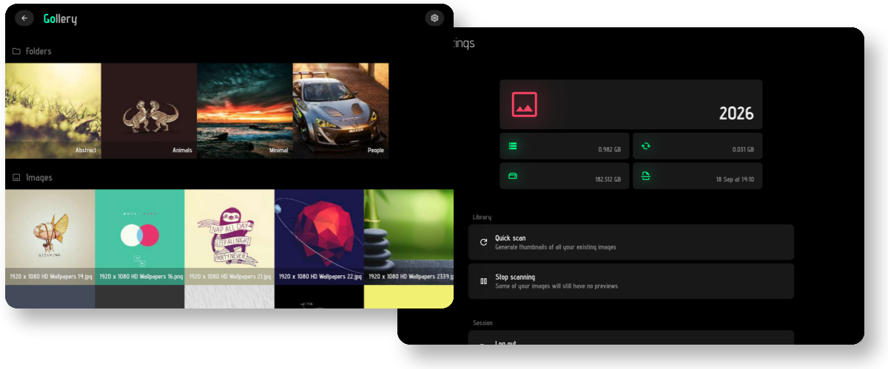

# Gollery

Extremely simple self-hosted gallery app written in Go.




### How to run

As for now, **build from source is necessary** as I did not provide any config options (thus building single binaries makes no sense).

```
# Get required dependencies
go get

# Run it
go run .

# Or compile and run
go build .
./gollery
```

- App will listen on `:8080`

- Default secret is `mysecret2137`


### Usage

Gollery creates two folders on first run:

- `cache` for generated thumbnails
- `images` for your image gallery (here you can place your files)

**Note:** you can safely place symlinks at the root of `images` directory if you don't want to move all your files here


### Final words?

Well, that's my first project in `Go`. It is not recommended to use it for production and extremely large image libraries. 

**However, I did my best so app is pretty usable :)**
